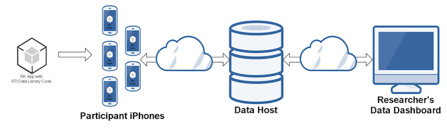

# Background

Apple iOS currently controls a little over 43% of the US smartphone market, providing access to more than 79 million iPhone users in the US. The ResearchKit platform immediately garnered a great deal of interest within the biomedical research community.   
 
As exciting as this new framework is Apple provided no guidance on how the data collected was to be stored and managed.  This is where the Biomedical Data as a Service Internal Research and Development (IR&D) project comes in.  Designed and implmented by the Research Computing Division, this solution includes the following basic components: an iOS code library, a cloud-based data host, a service layer implementing data exchange application programming interfaces, and a dashboard UI for management.  Instrument developers simply include the iOS library in their IOS application code to connect to the data service via the REST based web API.  Study managers manage their datasets and perform exploratory analytics via the dashboard UI. The system design and implementation incorporates US legal and regulatory compliance with respect to data privacy and security. 

Apple launched its ResearchKit framework for iOS on March 9, 2015. ResearchKit is an open source software framework designed to aid in the creation of mobile apps for biomedical and health research. ResearchKit simplifies construction of highly functional apps. Support is provided for various app modules, including informed consent, passive data collection, active tasks, surveys and data dashboards. Apple iOS currently controls a little over 43% of the US smartphone market, providing access to more than 79 million iPhone users in the US. The ResearchKit platform immediately garnered a great deal of interest within the biomedical research community.

Five apps developed with ResearchKit were also released at the debut press event. In March Stanford University researchers found that 11,000 people had signed up for a cardiovascular study using Apple Inc.’s ResearchKit, less than 24 hours after the iPhone tool was introduced. The Michael J. Fox Foundation for Parkinson’s Research collaborated with nonprofit group Sage Bionetworks to develop The Parkinson’s app, which had 5,589 consenting users with 24 hours of launch. These early results suggest a healthy future for biomedical research using data gathered from mobile apps, and for the ResearchKit framework. RCD has already developed a very simple ResearchKit app, but currently has no backend data service to securely receive and manage the data collected. Exhibit 1 is a screenshot of this example app. With our rich capabilities in health research, research data management, statistical analysis, and data sciences, we need to explore the potential of ResearchKit for our business. 

Deployed ResearchKit apps generate a great deal of data, presenting operational challenges for researchers.  Given the nature of the data, privacy and security concerns must be addressed with care. The ResearchKit framework provides no specific capabilities for dealing with these data, relying on built-in iOS functions. Apple offers no recommendations or backend service for storing, securing, managing and analyzing the data collected using ResearchKit apps. Researchers seeking to leverage this technology may not be able to easily develop deployable solutions without resolving significant technical challenges. 

These challenges represent an opportunity for RTI to step forward with solutions. We propose that RTI build the tools and framework necessary to provide biomedical data management for ResearchKit apps as:

* a capability offered to clients in the context of RTI-led biomedical research projects; and
* As an RTI-managed service offered to clients conducting their own biomedical research.

The solution would include the following basic components: an iOS code library, a cloud-based data host, a service layer implementing data exchange APIs, and a dashboard UI for management.  Exhibit 2 is a simplified diagram showing the flow of data between ReseachKit applications, the proposed backend data service, and researchers. Implementers would include the iOS library in their app code, and connect to our data host via the service APIs.  Users would manage their datasets and perform exploratory analytics via the dashboard UI. The system design and implementation would incorporate US legal and regulatory compliance with respect to data privacy and security. 

This project would build and demonstrate the feasibility of a service designed to gather and help analyze biomedical data from users of mobile apps developed using ResearchKit. This new capability would be a logical extension and modernization of our existing biomedical data collection, management, and research business. RTI currently cannot offer this capability to clients. 
This new service will leverage the experience skills of our staff in research data center technologies and operations (e.g. research protocol design and oversight, human subjects research, data privacy and security, data collection and management, statistical analysis, data visualization), and should help generate business in those areas. In developing this service the project team will consult the RTI Center for Advanced Health Information Technology (CAHIT), Information Technology Services (ITS), the Institutional Review Board (IRB), and the Center for Data Sciences (CDS). This service, while developed to receive data from ResearchKit applications running on iOS mobile devices, could also serve as a backend for other mobile applications for biomedical research, such as RTI’s PHIT application.
Examples of RTI projects that could use the new capabilities developed by this IR&D project immediately include the following:

* Emerging Technology Trends, a FY2016 IR&D project that will build a native iOS app for passive data collection using iBeacon or other sensor standards. 
* Disrupting the cycle of addiction: bringing biomarkers of behavior into better treatment, An RTI Grand Challenge Proposal current being reviewed.

---

### Research Objectives

1. Develop the internal capability to design and develop ResearchKit framework apps, and to securely collect the data in an RTI-managed backend data service.

2. Provide a platform with known capabilities and costs, increasing bid timeliness and accuracy.

3. Assess privacy and security issues within framework of regulatory compliance, addressing these in the system design.

4. Develop effective tools for managing and analyzing the data as they are received from ResearchKit framework apps.

5. Increased RTI's scientific stature within the biomedical research community for having leading-edge data services capability.

6. Provide RTI with a commercialization opportunity

---

### Statement of Work

Each iteration being set based on the full objectives as well as the results of the previous iterations and related stakeholder feedback. 

The basic progression of tasks toward goals is listed here.  Note that these activities will be interleaved and concurrent, rather than consecutive.

### Milestones

| October - January | Planned Activities | Notes/Comments      
----------- | ----------- | -----------
Task 1: Establishment of product definition | - Scan competitive landscape.  - Review target audience needs.  - Establish feature list and version plan. | The project team will consult CAHIT.
Task 2: Document requirements for iOS code library | Document technical requirements for the iOS library component. | 
Task 3: Document basic requirements for cloud data service | The project team will consult RTI-ITS and the IRB to develop and document requirements for cloud service providers. | Analysis and requirements gathering for the cloud data service components
Task 4: Identification of potential cloud provider/partners| - Research of provider capabilities, reputation, costs, etc.   - Develop short list of top provider/partner candidates.| The project team will consult RTI-ITS to review requirements and assess potential cloud service providers. Potential cloud services include IBM Softlayer, Microsoft Azure, and Amazon Web Services

| February - May | Planned Activities | Notes/Comments      
----------- | ----------- | -----------
Task 5: Selection of cloud provider/partner | - Scan competitive landscape.  - Confer with stakeholders, review options and make decision. | Stakeholders consulted by the project team will include RTI-ITS and the IRB.
Task 6: Document detailed requirements and design for cloud data service and dashboard UI | Knowing provider, develop and document requirements and system design |
Task 7: Early data service development | Kick off data service development|
Task 8: Early dashboard UI development | Kick off dashboard development |
Task 9: Development of iOS code library | Development and service integration of iOS component |

| June - September | Planned Activities | Notes/Comments      
----------- | ----------- | -----------
Task 10: Data service development | Development, testing, demo/pilot planning | 
Task 11: Dashboard UI development | Development, testing, demo/pilot planning |
Task 12: Testing data service integration with iOS components | Integration testing and differential development |
Task 13: Demo/Pilot of iOS app using data service | Complete a demo app using data service integration |
Task 14: Demo/Pilot of dashboard UI | Complete a demo/pilot of dashboard app using service hosted data |

---

### Budget Summary

Research and development hours to support the activities listed above.   

#### The basic skill categories

* System analysis and design
* iOS development and publishing
* Cloud service development and operations
* Dashboard UI design and development
* Project coordination

#### Labor assignments

* Adam Preston, iOS prototype development, cloud services and coordination, 160 hours
* Chris Siege, Data visualization, 60 hours
* Ron Thigpen, Cloud services, analysis and coordination 100 hours

#### Other Direct Costs (ODCs)

* Cloud hosting services, $100 / mo X 9 mos
* SSL security certificate, $50 ea X 1
* Domain registration, $50 ea X 1
* Development appliance, $600 ea X 1

---

### Expected Results
1. A working pilot data service integrating with ResearchKit apps
2. An available iOS component library for interaction with our data service
3. A demonstrable app built using the ResearchKit framework, our iOS library, and our data service
4. A small dataset generated with our app
5. Demonstrate a dashboard UI for data management and visual analysis

---

### Supporting Comments (from management)

Apple Inc.’s ResearchKit is a new platform for advanced medical research using Apple’s leading edge mobile devices. This platform provides access to more than 40% of smartphone users in the US. Apple’s market share in other developed countries is similar. We should take advantage of this opportunity and add this capability to our existing set of research tools.
