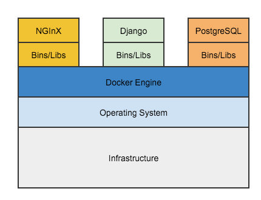

## Introduction

Put brief introductory paragraph here.

## Architecture

## Application Architecture

The web application provides an application programming interface (API) and management console.  The application flow begins with an authentication and when successul results in a session token which is used by the client for all subsequent calls. The user database is a relational database used for storing users and groups.  The response database is a document oriented database used for storing the survey reponses.

## Deployment Architecture

Containers include the application and all of its dependencies, but share the kernel with other containers. They run as an isolated process in userspace on the host operating system. They’re also not tied to any specific infrastructure – Docker containers run on any computer, on any infrastructure and in any cloud.  In our case here we maintain 3 linked containers, one for the web application and API with Python Django, one for the user database with Postgres SQL, and finally one for the survey response database with MongoDB.

## Deployment

Currently we certify a HIPPA compliant configuration with the following cloud service providers:

### Amazon Web Services

Blurb about how to run a docker cluster on Digital Ocean. This will probably start off with a description of Amazon Web Services's EC2 Container service.

### Digital Ocean
Blurb about how to run a docker cluster on Digital Ocean.

### Microsoft Azure
Blurb about how to run a docker cluster on Azure.

### IBM Softlayer
Blurb about how to run a docker cluster on softlayer.

