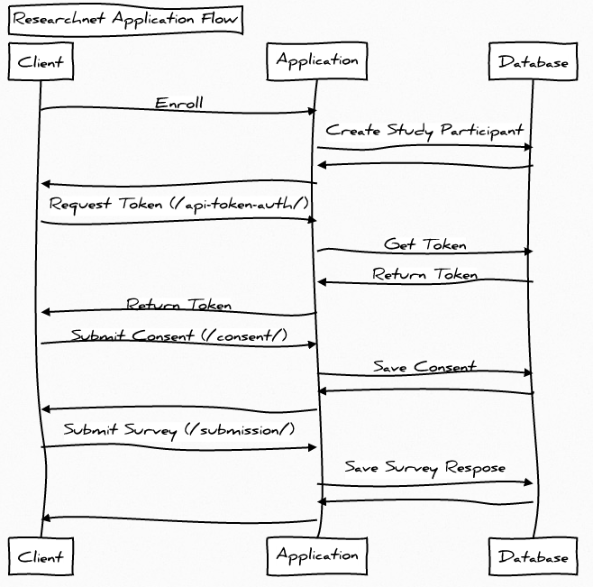

## Introduction

Put brief introductory paragraph here.

## Architecture

## Overview

The Researchnet service is composed to two things: one, a web application provides which an application programming interface (API), a management console, and a relational database.  The application flow begins with an authentication and when successful results in a session token which is used by the client for all subsequent requests. The database is a relational database used for storing users and groups as well storing the survey reponses.

## Deployment

Currently we certify a HIPPA compliant configuration with using Docker containers and support the following cloud service providers: Amazon Web Services (AWS), Digital Ocean, Microsoft Azure, and IBM Softlayer.

